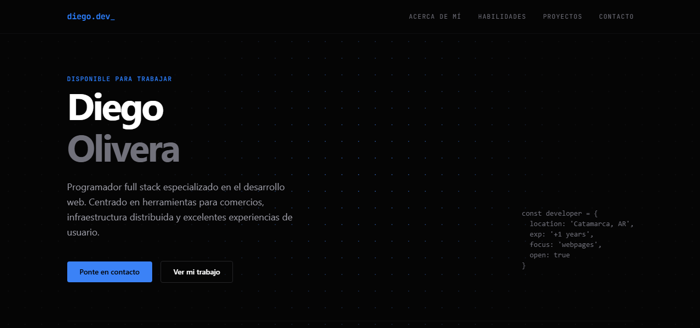

# Diego Olivera — Junior Developer Full Stack Portfolio



> **Live Demo:** [diego-olivera.vercel.app](https://diego-olivera.vercel.app)

Un portafolio profesional minimalista, enfocado en el rendimiento y diseñado para destacar la experiencia de usuario (UX) y el impacto técnico. Construido para demostrar habilidades avanzadas de frontend y arquitectura moderna.

## ⚡ Stack Tecnológico

El proyecto está desarrollado utilizando herramientas modernas orientadas al rendimiento y la escalabilidad:

*   **Framework Base:** [Next.js](https://nextjs.org/) (App Router)
*   **Lenguaje:** TypeScript
*   **Estilos:** [Tailwind CSS](https://tailwindcss.com/)
*   **Animaciones:** [Framer Motion](https://www.framer.com/motion/)
*   **Despliegue:** [Vercel](https://vercel.com/)

## 🏗️ Arquitectura y Características Destacadas

*   **Fondo Interactivo (Spotlight Grid):** Máscara CSS dinámica y `radial-gradient` que rastrea la posición del cursor utilizando eventos de estado en React.
*   **Renderizado de Componentes Híbridos:** Mezcla óptima de Componentes de Servidor (velocidad de carga y SEO) y Componentes de Cliente (animaciones con Framer Motion).
*   **Estructura Semántica y Accesibilidad:** Navegación *sticky* fuera del flujo principal, manejo adecuado de estados y etiquetas semánticas para mejorar el alcance orgánico.
*   **Diseño Totalmente Responsivo:** Transiciones fluidas entre CSS Grid (Desktop) y Flexbox (Móvil) para garantizar integridad visual en todos los dispositivos.

## 🚀 Instalación y Desarrollo Local

Si deseas clonar el proyecto para explorarlo o usarlo como base:

1. Clona el repositorio:
   ```bash
   git clone [https://github.com/devDOlivera/tu-repo.git](https://github.com/devDOlivera/tu-repo.git)
   ```

2. Instala las dependencias:
   ```bash
   npm install
   ```

3. Inicia el servidor de desarrollo:
   ```
   npm run dev
   ```

4. Abre <http://localhost:3000> en tu navegador.

## 🎯 Sobre el Autor

Soy un desarrollador full stack de Catamarca, Argentina. Me enfoco en construir sistemas rápidos y confiables, herramientas para comercios e infraestructura distribuida. Constantemente investigo nuevas tecnologías para compartir aprendizajes técnicos y aportar valor estratégico más allá de la simple escritura de código.

- **Email:** diegoolivera539@gmail.com
- **GitHub:** @devDOlivera

*Diseñado e implementado por Diego Olivera © 2026*
